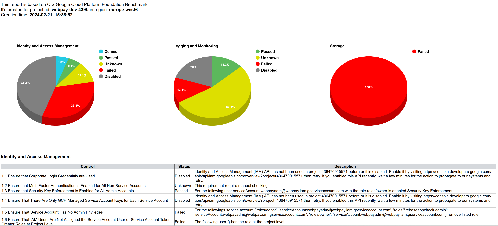

# Google Cloud CIS benchmark scanner

This is tool to benchmark GC environment against guide CIS Google Cloud Platform Foundation Benchmark v1.3.0 - 03-31-2022.
Tools is not an officially Google Cloud product, also is not approved by Center for Internet Security (CIS).
Currently available modules are for Identity and Access Management, Logging and Monitoring and Storage, other are are currently in progress. 
It's providing automatically checking every control, and as result give report in html or txt format. Every control can has one of the following status:
_Passed_, _Failed_, _Unknown_, _Disabled_ and _Denied_

## Table of Contents

- [Requirements](#requirements)
- [Setup](#setup)
- [Usage](#usage)
- [Example](#example)


### Requirements

* Python >= 3.8.2
* Pip >= 23.1.2

### Setup

Download github project:
```bash
git clone https://github.com/iha-code/gc-cis-benchmark.git
cd gc-cis-benchmark
```
Setup virtual environment 

navigate to root project directory and run: 

```bash
Unix: python virtualenv env
Windows: python -m virtualenv env
```

set the virtual environment:

```bash
Linux: source env/bin/activate
Windows: env\Scripts\activate.bat
```

Installation required packages
```bash
python -m pip install --upgrade -r requirements.txt
```


### Usage
For running tool minimal recommended permission for authenticated service account or user is _roles/editor_

```bash
usage: python3 main.py [optional arguments]

Tool to benchmark your GC environment against CIS

optional arguments:
  -h, --help            show this help message and exit
  -c CONFIG_FILE, --config_file CONFIG_FILE
                        PROJECT_NAME.conf config file
  --oauth2 {sacred,uscred}
                        credentials based on OAuth 2.0 access
                        sacred - OAuth 2.0 Service Accounts Credentials
                        uscred - User OAuth 2.0 credentials that authorize access to a user’s data

  -b BENCHMARK, --benchmark BENCHMARK
                        Choose one or more Google Cloud services for benchmark,
                        iam -       Benchmark  for Identity and Access Management
                        logmon -    Benchmark  for Logging and Monitoring
                        net -       Benchmark  for Networking
                        vm -        Benchmark  for Virtual Machines
                        storage -   Benchmark  for Storage
                        mysql -     Benchmark  for MySQL Database
                        postgres -  Benchmark  for PostgreSQL Database
                        mssql -     Benchmark  for SQL Server
                        bq -        Benchmark  for BigQuery

  -f {txt,html}         Format output type txt or html
  -v, --version         Display version of the tool
```

### Example
Below there is example of scanning process which create report in the format name _GC_CIS_REPORT_yyyy-mm-dd_hh24_mi_ss.html_, with 3D pie charts and tables. 
```bash
python main.py -c gc.conf --oauth2 sacred --benchmark iam,logmon,storage -f html
Minimal recommended role for authenticated service account is roles/editor
... scanning Identity and Access Management services
... scanning Logging and Monitoring services
... scanning Storage services
Created report reports/GC_CIS_REPORT_2024-02-26_15_04_46.html
```
GC_CIS_REPORT.html



